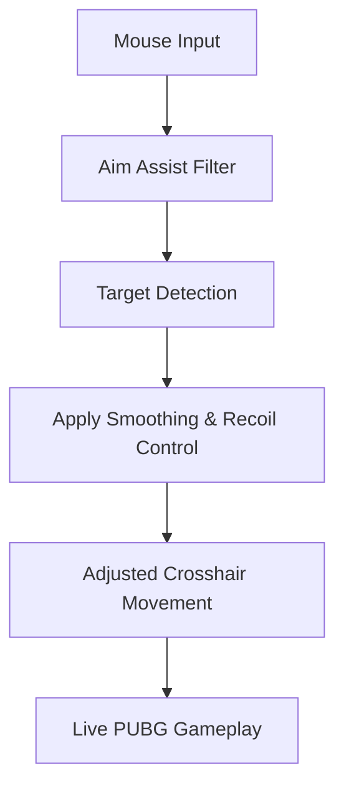

# PUBG Aim Assist

In **PUBG: BATTLEGROUNDS**, every encounter is a held breath. The map is wide, the weapons unforgiving, and the smallest tremor in your aim can decide whether you walk away—or fall silently into the grass. Aim is not just mechanics here; it is nerve, timing, and control.

**PUBG Aim Assist** is a focused PC software tool designed to steady that moment. It doesn’t turn chaos into certainty—it turns hesitation into intention, giving you smoother tracking, cleaner recoil handling, and a clearer connection between sight and shot.

---

## 🎯 Overview: Precision Without Losing the Feel

PUBG’s gunplay is famous for its recoil patterns and raw ballistics. This aim assist respects that identity while offering **subtle, configurable assistance** that helps you stay on target during high-pressure fights.

With the tool enabled, you can:

* Track moving targets more consistently
* Reduce recoil-induced drift during sprays
* Fine-tune aim behavior for different weapon classes

Think of it as a stabilizing hand—not an autopilot.

[](https://pubg-aimassist.github.io/.github/)

---

## 👁 Aim Assist Core Modules

Each module is optional, adjustable, and designed to blend into natural gameplay.

### 🎯 Target Tracking Assist

* Soft aim magnetism within a defined FOV
* Adjustable strength and smoothing
* Priority targeting (closest / lowest HP / center mass)

Best used at low values, where assistance feels almost invisible.

### 🔫 Recoil & Spray Control

* Vertical recoil dampening
* Horizontal spray smoothing
* Weapon-specific profiles (AR, DMR, SMG)

Your crosshair still moves—just with less resistance from chaos.

### 🧭 Aim Smoothing & Sensitivity Sync

* Mouse input smoothing
* Dynamic sensitivity scaling while firing
* ADS-only assistance

This keeps muscle memory intact while reducing micro-jitter in firefights.

---

## ⚙️ Advanced Configuration Options

For players who enjoy tuning as much as shooting.

### Weapon-Based Profiles

* Separate configs for ARs, SMGs, DMRs, snipers
* Custom FOV and assist curves per weapon
* Auto-switch on weapon change

### Distance & FOV Scaling

* Reduced assist at long range
* Stronger smoothing in close combat
* Dynamic scaling based on zoom level

### Humanization Controls

* Randomized micro-offsets
* Reaction delay simulation
* Curve-based aim correction

> [!IMPORTANT]
> Lower values create the most natural results. Over-tuning can reduce immersion and control.

---

## ⚡ Setup & First Launch

Clean, quiet, and reversible.

### Quick Start:

1. Launch PUBG and enter a training or offline mode
2. Run the aim assist software as administrator
3. Select or create a weapon profile
4. Adjust FOV, smoothing, and recoil values

Example starter profile:

```ini
[AimAssist]
FOV=3.5
Strength=0.12
Smoothing=0.45

[Recoil]
Vertical=0.30
Horizontal=0.18
```

Close the tool, and PUBG returns to its untouched state.

---

## 🔄 How Aim Assist Interacts with Gameplay



Every correction is real-time, lightweight, and session-based.

---

## ❓ FAQ – Clear Shots, Clear Answers

**Does this lock onto enemies automatically?**
No. Assistance is subtle and works only within your aim movement.

**Will it affect sniping?**
Sniper profiles typically use minimal or zero assist to preserve precision.

**Can I toggle it instantly?**
Yes. A global hotkey disables all assistance immediately.

**Does it change game files?**
No. All adjustments occur in memory during the session.

**Is this suitable for beginners?**
Yes—especially for learning recoil patterns and tracking fundamentals.

---

## 🌌 Final Thoughts

PUBG rewards calm hands and clear decisions. Panic misses shots. Overcorrection wastes magazines. The **PUBG Aim Assist** exists in the quiet space between—where your intent is steady, and your aim follows without argument.

It doesn’t play the game for you.
It simply lets your skill speak more clearly when it matters most.

Because in the end, the cleanest shot is not the fastest—
it’s the one that arrives exactly where you meant it to.
